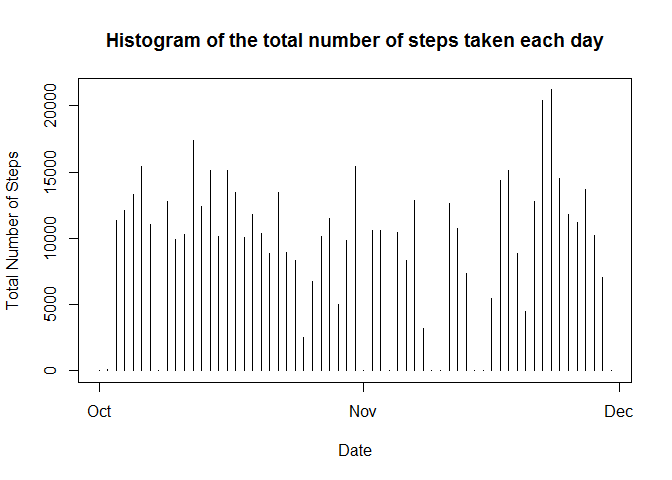
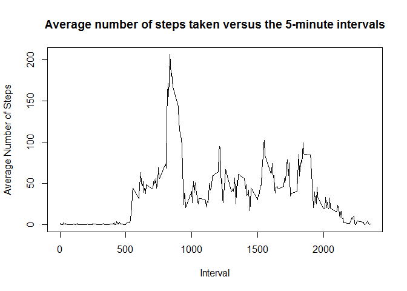
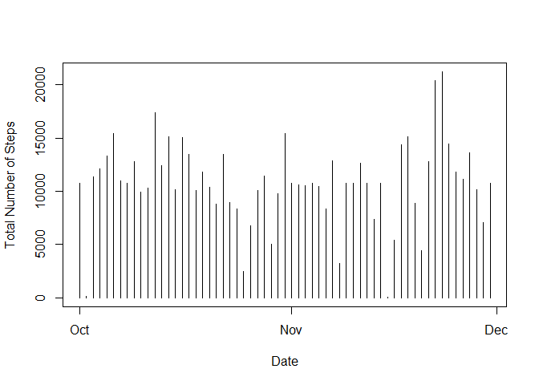
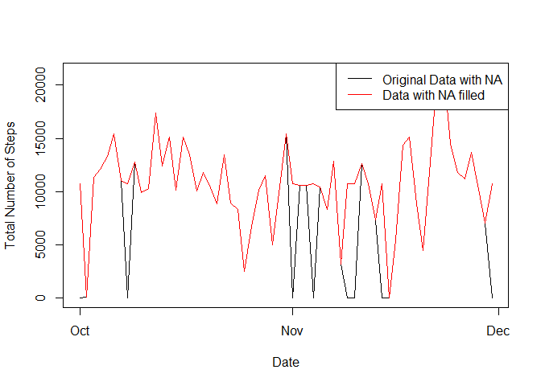
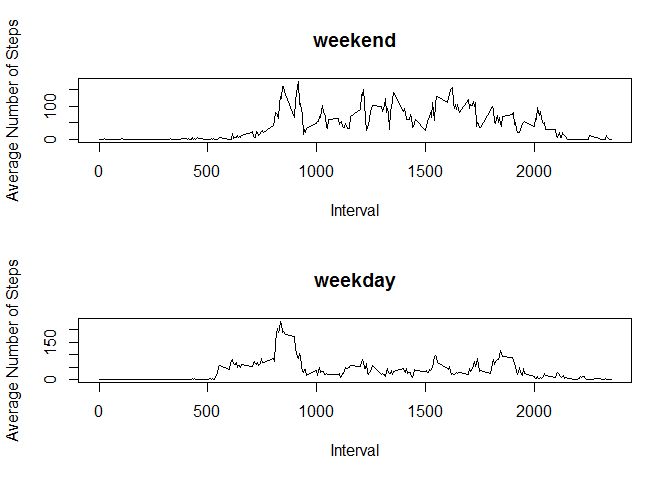

# Reproducible Research: Peer Assessment 1


## Loading and preprocessing the data

```r
mydata <- read.csv("activity//activity.csv"
                   ,sep=","
                   ,na.strings="NA")

library(tidyr)
library(dplyr)
```

```
## 
## Attaching package: 'dplyr'
## 
## The following object is masked from 'package:stats':
## 
##     filter
## 
## The following objects are masked from 'package:base':
## 
##     intersect, setdiff, setequal, union
```

```r
library(lubridate)
Sys.setlocale(category="LC_TIME", locale="English")
```

```
## [1] "English_United States.1252"
```

```r
mydata <- mutate(mydata,Date=ymd(mydata$date))
head(mydata)
```

```
##   steps       date interval       Date
## 1    NA 2012-10-01        0 2012-10-01
## 2    NA 2012-10-01        5 2012-10-01
## 3    NA 2012-10-01       10 2012-10-01
## 4    NA 2012-10-01       15 2012-10-01
## 5    NA 2012-10-01       20 2012-10-01
## 6    NA 2012-10-01       25 2012-10-01
```


## What is mean total number of steps taken per day?
### Histogram of the total number of steps taken each day:  

```r
mydata <- group_by(mydata,Date)
sum1_data<-summarise(mydata,Steps=sum(steps,na.rm = TRUE))
plot(sum1_data$Date
    ,sum1_data$Steps
    ,type="h"
    ,xlab="Date"
    ,ylab="Total Number of Steps"
    ,main="Histogram of the total number of steps taken each day")
```

 

### Mean and median total number of steps taken per day: 


```r
d1_mean <- mean(sum1_data$Steps)
d1_mean
```

```
## [1] 9354.23
```

```r
d1_median <- median(sum1_data$Steps)
d1_median
```

```
## [1] 10395
```

Mean is 9354.2295082 and median is 10395 for number of steps taken each day.

## What is the average daily activity pattern?

```r
mydata <- group_by(mydata,interval)
d1<-summarise(mydata,Steps=mean(steps,na.rm = TRUE))
plot(d1$interval,d1$Steps,type="l",xlab="Interval",ylab="Average Number of Steps"
    ,main="Average number of steps taken versus the 5-minute intervals")
```

 

### Which 5-minute interval, on average across all the days in the dataset, contains the maximum number of steps?


```r
i_inter <- as.numeric(subset(d1,d1$Steps == max(d1$Steps))[1])
i_inter
```

```
## [1] 835
```

Maximum of averge steps are in interval: 835

## Imputing missing values

### Total number of rows with NAs


```r
n_na <- sum(is.na(mydata$steps))
n_na
```

```
## [1] 2304
```

Number of NA's in data set is 2304
  
Stratefy to Populate NA's is to use mean of all days for given interval and store in mydata_f


```r
mydata_f <- inner_join(mydata,d1, by="interval")
mydata_f$steps[is.na(mydata_f$steps)] = mydata_f$Steps[is.na(mydata_f$steps)]
head(mydata_f)
```

```
## Source: local data frame [6 x 5]
## Groups: interval
## 
##       steps       date interval       Date     Steps
## 1 1.7169811 2012-10-01        0 2012-10-01 1.7169811
## 2 0.3396226 2012-10-01        5 2012-10-01 0.3396226
## 3 0.1320755 2012-10-01       10 2012-10-01 0.1320755
## 4 0.1509434 2012-10-01       15 2012-10-01 0.1509434
## 5 0.0754717 2012-10-01       20 2012-10-01 0.0754717
## 6 2.0943396 2012-10-01       25 2012-10-01 2.0943396
```

Let's see histogram of data with NA filled:


```r
mydata_f <- group_by(mydata_f,Date)
sum2_data <-summarise(mydata_f,Steps=sum(steps,na.rm = TRUE))
plot(sum2_data$Date,sum2_data$Steps,type="h",xlab="Date",ylab="Total Number of Steps")
```

 


### New Mean and median total number of steps taken per day:  

```r
d2_mean <- mean(sum2_data$Steps)
d2_mean
```

```
## [1] 10766.19
```

```r
d2_median <- median(sum2_data$Steps)
d2_median
```

```
## [1] 10766.19
```

```r
diff_mean <- d2_mean - d1_mean
diff_median <- d2_median - d1_median
```

Difference of mean is  1.0766189\times 10^{4} - 9354.2295082 = 1411.959171  
Difference of median is  1.0766189\times 10^{4} - 10395 = 371.1886792  

Let's see histogram difference in plot


```r
plot(sum1_data$Date
    ,sum1_data$Steps
    ,type="l"
    ,xlab="Date"
    ,ylab="Total Number of Steps")
lines(sum2_data$Date,sum2_data$Steps,col="red")
legend("topright", 
       legend = c("Original Data with NA"
                 ,"Data with NA filled"
                 ),
       col = c("black", "red"), 
       lwd = 1, 
       cex = 1
       )
```

 


## Are there differences in activity patterns between weekdays and weekends?


```r
mydata <- mutate(mydata, day_type = "weekday" )
mydata$day_type[ weekdays(mydata$Date) == "Sunday" 
               | weekdays(mydata$Date) == "Saturday"  ] <- "weekend" 


d_weekday <- filter(mydata,day_type=="weekday")
d_weekend <- filter(mydata,day_type=="weekend")

d_weekday <- group_by(d_weekday,interval)
d_weekend <- group_by(d_weekend,interval)

d_weekday <- summarise(d_weekday,Steps=mean(steps,na.rm = TRUE))
d_weekend <- summarise(d_weekend,Steps=mean(steps,na.rm = TRUE))


par(mfrow=c(2,1))

plot(d_weekend$interval
    ,d_weekend$Steps
    ,type="l",xlab="Interval",ylab="Average Number of Steps"
    ,main="weekend"
    )

plot(d_weekday$interval
    ,d_weekday$Steps
    ,type="l",xlab="Interval",ylab="Average Number of Steps"
    ,main="weekday"
    )
```

 

